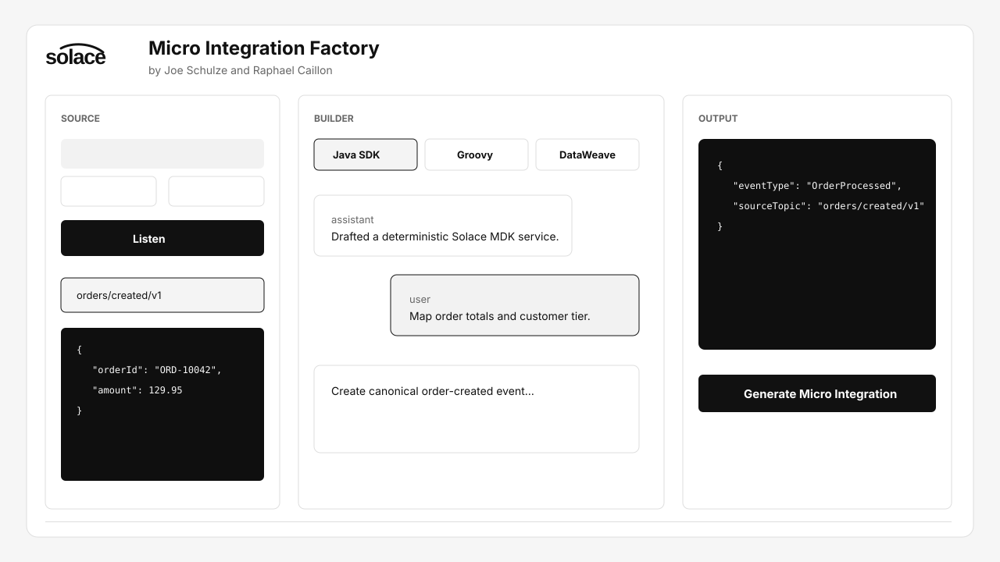
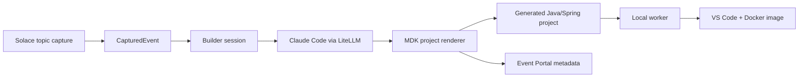

# Micro Integration Factory

Solace-inspired AI workbench for building micro-integrations from live event payloads.

The workbench captures a Solace event, lets you describe the target behavior in chat,
asks Claude through LiteLLM for an implementation-ready plan, previews a sample output,
then generates a Solace MDK Java/Spring project and queues a local VS Code plus Docker build job.



## What It Builds

- Solace MDK micro-integration projects using `micro-integration-build-parent`
- Java SDK runtime code by default
- Optional Groovy transform drafts
- Optional DataWeave `.dwl` drafts with equivalent Java runtime output
- Docker-ready generated projects with Solace workflow configuration
- Event Portal-ready canonical topics, schemas, applications, and event metadata

## Quickstart

```bash
cp .env.example .env
make bootstrap
npm run dev
```

Open [http://localhost:3000](http://localhost:3000) and use the default `demo://sample`
broker to create the first generated project without a real broker. The app is public by
default for demos; set `DISABLE_AUTH=false` only if you want to restore the admin password gate.

For a real Solace broker, set:

```bash
SOLACE_BROKER_URL=tcp://your-broker:55555
SOLACE_VPN=default
SOLACE_USERNAME=...
SOLACE_PASSWORD=...
SOLACE_WEB_MESSAGING_URL=...
```

## LiteLLM

The API calls any OpenAI-compatible LiteLLM endpoint. In the hosted app, configure it from
Settings -> AI Provider so the base URL, API key, and model are stored in the encrypted
settings table. Environment variables remain as a local developer fallback only.

The builder uses Claude Sonnet through LiteLLM to infer implementation assumptions, produce a
sample output, choose the output topic, and generate only the transformation artifact. The
Solace MDK scaffold comes from the project template. The generation flow stores the
Claude/LiteLLM draft in `ai/claude-code-plan.json` inside the generated project. LiteLLM is
required for live design, preview, and project generation; there is no local draft fallback.

## Architecture



The imported foundation comes from [`solacese/agentic-integration-factory`](https://github.com/solacese/agentic-integration-factory) and includes FastAPI orchestration, Next.js UI, Solace live bridge, MDK templates, Docker/ECR build adapters, and Event Portal sync.

## AWS SaaS Target

The hosted architecture is designed for:

- Web/API on ECS Fargate behind an ALB
- RDS Postgres for workbench state
- ElastiCache Redis for queued jobs
- S3 for generated artifacts
- ECR for generated images
- AWS Secrets Manager for broker, LiteLLM, registry, and Event Portal credentials

The local worker remains optional in hosted mode and is responsible for local VS Code open plus local Docker builds.

Fast deploy with a refreshable AWS profile, SSO, `credential_process`, instance role, or
fallback STS values:

```bash
# Preferred: let the AWS SDK refresh credentials from ~/.aws/config.
AWS_PROFILE=mi-deploy ./infra/scripts/deploy.sh

# Optional: keep defaults in .env instead of exporting them each time.
cp .env.example .env
# Set AWS_PROFILE=mi-deploy, AWS_ROLE_ARN=... if needed, and PUBLIC_BASE_URL=...
./infra/scripts/deploy.sh

# The script updates the running EC2 host in place when SSM is available,
# otherwise it falls back to the full EC2 replacement path.

# Open the hosted app and configure LiteLLM in Settings -> AI Provider.

# Optional aliases/status:
make deploy
make aws-status
make aws-down
```

Useful `.env` deploy values:

```bash
AWS_REGION=ca-central-1
AWS_PROFILE=mi-deploy
AWS_SDK_LOAD_CONFIG=1
AUTO_AWS_SSO_LOGIN=true
AWS_ROLE_ARN=
AWS_ROLE_SESSION_NAME=micro-integration-factory-deploy
PUBLIC_BASE_URL=http://mi.sol-se-emea.com
CONTROL_PLANE_ALLOWED_CIDR=0.0.0.0/0

# Fallback only for pasted short-lived STS credentials:
AWS_ACCESS_KEY_ID=
AWS_SECRET_ACCESS_KEY=
AWS_SESSION_TOKEN=
```

## Security

- Never commit `.env`, cloud credentials, broker credentials, or LiteLLM keys.
- Rotate any credential pasted into chat, logs, issues, or screenshots.
- Store production secrets in AWS Secrets Manager or the encrypted settings store.
- Generated projects should be reviewed before production deployment.

## Development

```bash
make test
make lint
npm run build:web
```

Main folders:

- `apps/web` - Next.js workbench
- `apps/api` - FastAPI control plane and generator
- `apps/api/resources/templates` - Solace MDK project templates
- `apps/api/resources/mdk-reference` - Solace MDK reference project
- `infra/docker` - local Postgres, Redis, Solace, and API compose files

## License

Apache 2.0.
